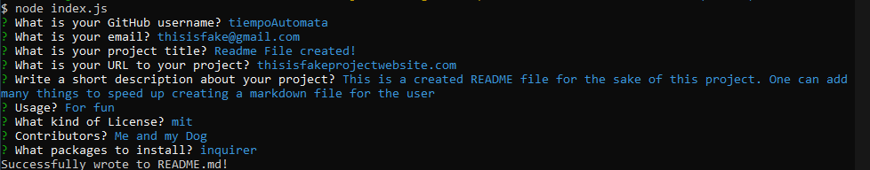

# HWReadMEGenerator 

## Description
This is a node application to create a README file quickly through simple questions and inputs. The code uses the node packages **inquirer** and **axios** to ask the user and receive inputs and retrieve the GitHub information respectively. After which, when done it will create a simple README.md file for use, saved in the /READMEFolder.

### Image of the Program

